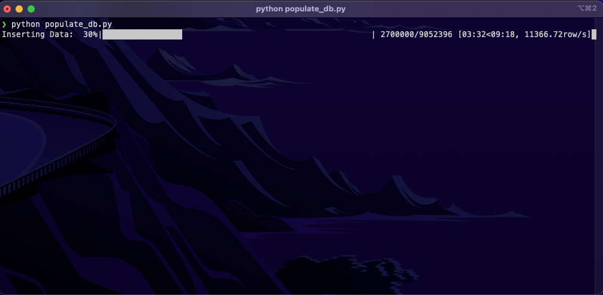
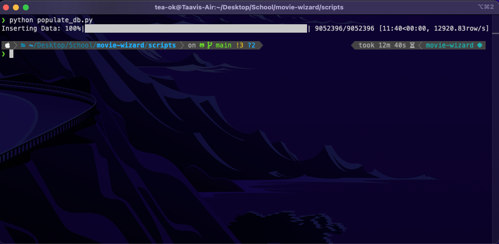
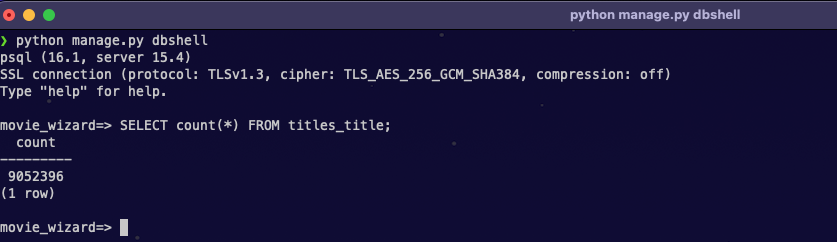

# Documentation
### This README contains the whole workflow of the project, including the planning, development, testing and deployment. It is written in Markdown and is intended to be read on GitHub.

## Table of contents
- [Planning](#planning)
    - [Tech stack](#tech-stack)
- [Development](#development)
    - [Database](#database)
- [Testing](#testing)
- [Deployment](#deployment)

## Planning

I got the idea for this project by searching for datasets. I wanted a large dataset, so that I could practice working with databases. I found a dataset of over 10 million movies on IMDB's developer website, which seemed like a good fit.

### Tech stack
- Django (Python)
    - I decided to use Django as a framework, because I work with Python a lot and I wanted to try out a robust and popular framework.
- PostgreSQL
    - I chose PostgreSQL as a database, because it is open-source and has a lot of features. Additionally, I've used it before so I was familiar with it.
- Azure
    - I chose Azure as a cloud provider, because Microsoft offers a lot of free services for students. I had never used a cloud provider before, so I wanted to try it out.

## Development

### Database

I started by creating an account on Azure with my student email, after which I created a PostgreSQL server with a database in it called "movie_wizard". I then created the general framework for the project with Django and connected it to the database.

I then created a model for the titles, which can be found [here](../movie_wizard/titles/models.py):

| Field Name | Data Type | Max Length | Null |
|------------|-----------|------------|------|
| title_type | CharField | 50 | No |
| primary_title | CharField | 512 | No |
| original_title | CharField | 512 | No |
| is_adult | BooleanField | N/A | No |
| start_year | IntegerField | N/A | Yes |
| runtime_minutes | IntegerField | N/A | Yes |
| genres | CharField | 255 | Yes |

I had to do some cleaning of the data before inserting it into the table, which I did in this [Jupyter Notebook](../data.ipynb). After this, I created [this script](../scripts/populate_db.py) to populate the database with the data, which took 12 minutes and 40 seconds to run:

After that, all 9,052,369 titles were in the database:

