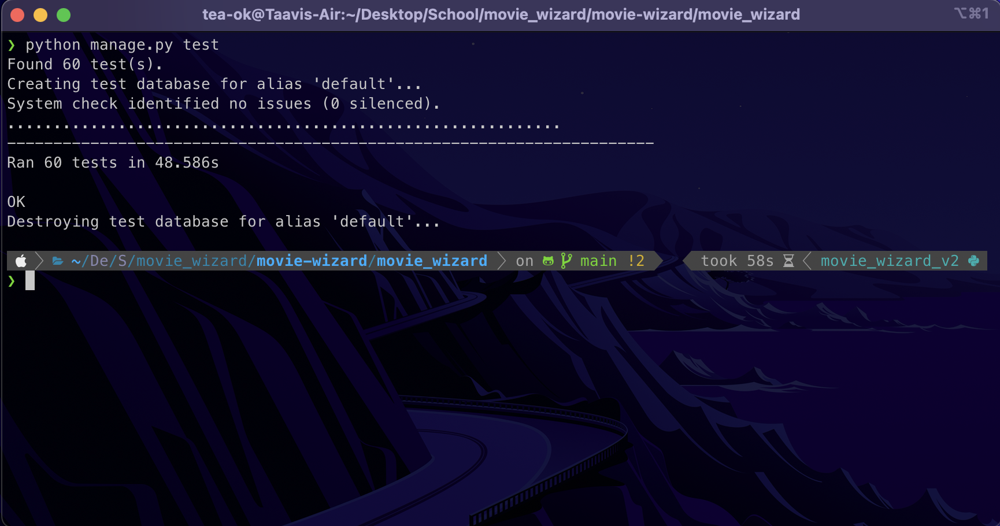

# Documenting my learning journey - API Development with Django

### API Documentation: [here](https://documenter.getpostman.com/view/24394414/2s9YkgE5aP)

### Video Demo: [here](https://www.youtube.com/watch?v=aCL7O36um_w)

## Table of Contents

-   [Technologies](#technologies)
-   [Final Backend Structure](#final-backend-structure)
    -   [ERD](#erd)
-   [Workflow](#workflow)
    -   [Initial setup](#initial-setup)
    -   [Created the models for the database schema](#created-the-models-for-the-database-schema)
    -   [Created the serializers for the models](#created-the-serializers-for-the-models)
    -   [Created the views for the models + associated routes](#created-the-views-for-the-models--associated-routes-available-in-the-respective-urlspy-files)
    -   [Created the frontend](#created-the-frontend)
    -   [Wrote tests for all the routes](#wrote-tests-for-all-the-routes)
-   [Conclusion](#conclusion)
    -   [Time spent](#time-spent)
    -   [Self-assessment](#self-assessment)

### Technologies

-   [Django](https://www.djangoproject.com/)
-   [Django REST Framework](https://www.django-rest-framework.org/)
-   [PostgreSQL](https://www.postgresql.org/)
-   [Azure](https://azure.microsoft.com/en-us/)

### Final Backend Structure

Here's the structure of the final project. `admin.py` files were left empty, as I didn't need to use the admin panel. Apart from that, all files have something:

```
movie_wizard
|-- accounts
| |-- admin.py
| |-- apps.py
| |-- models.py
| |-- serializers.py
| |-- tests.py
| |-- urls.py
| |-- views.py
|
|-- movie_wizard
| |-- settings.py
| |-- urls.py
| |-- asgi.py
| |-- deployment.py
| |-- .env
| |-- wsgi.py
|
|-- reviews
| |-- admin.py
| |-- apps.py
| |-- models.py
| |-- serializers.py
| |-- tests.py
| |-- urls.py
| |-- views.py
|
|-- titles
| |-- admin.py
| |-- apps.py
| |-- models.py
| |-- serializers.py
| |-- tests.py
| |-- urls.py
| |-- views.py
|
|-- watchlist
|-- admin.py
|-- apps.py
|-- models.py
|-- serializers.py
|-- tests.py
|-- urls.py
|-- views.py
```

#### ERD

Generated with PgAdmin4:


### Workflow

#### Initial setup:

-   Created an Azure PostgreSQL server and database for the project.
-   Downloaded the IMDB movie data from the [IMDB Developer Website](https://developer.imdb.com/non-commercial-datasets/).
-   [Cleaned the data](../data/data.ipynb) using my Data Science skills.
-   Wrote a [script](../scripts/populate_db.py) to insert the 2 million+ titles into the database.
-   Created a Django project and app, and connected it to the database.
-   Adding middleware such as CORS and authentication to the project.

#### Created the models for the database schema:

-   [accounts/models.py](../movie_wizard/accounts/models.py)

    -   Using the built-in Django `User` model for authentication.
    -   Created an additional `UserProfile` model which adds a new table for storing the user's date of birth, with a one-to-one relationship with the User model.

-   [titles/models.py](../movie_wizard/titles/models.py)

    -   Features a `Title` model which stores the title's `title_type`, `primary_title`, `original_title`, `is_adult`, `start_year`, `end_year`, `runtime_minutes`, `genres` and `average_review`.
    -   `average_review` is a calculated field which is updated every time review is saved or deleted.

-   [reviews/models.py](../movie_wizard/reviews/models.py)

    -   Features a `Review` model which stores the review's `title`, `user`, `rating`, `text`, `created_at` and `updated_at`.
    -   `created_at` and `updated_at` are automatically generated when the review is created or updated.
    -   The `title` and `user` fields have foreign key relationships with the `Title` and `User` models, respectively.

-   [watchlist/models.py](../movie_wizard/watchlist/models.py)

    -   Features a `Watchlist` model which stores the watchlist's `title`s and the associated `user`.
    -   The `title` and `user` fields have foreign key relationships with the `Title` and `User` models, respectively.

    I was pleasantly surprised at how efficient Django's ORM is. I thought I would have to write a lot of SQL queries, but the ORM handles most of the heavy lifting for you, as long as you know what you're doing. I also like how easy it is to create relationships between models.

#### Created the serializers for the models:

-   [accounts/serializers.py](../movie_wizard/accounts/serializers.py)

    -   Features a `UserSerializer` which serializes the `User` model.
        -   `date_of_birth` is a DateField that maps to the field in the `UserProfile` model with the same name.
        -   `first_name` and `last_name` are CharFields that are set to a max length of 30 characters.
        -   The `Meta` class specifies the `User` model and fields to be serialized (excluded the password field for security reasons, so it's not returned in the response).
        -   There are also two validation methods, for validating the date of birth (to ensure that the user is at least 13 years old) and the email, using the `validate_email` method from Django Core Validators.
        -   The `create` method is overridden to create both a `User` and associated `UserProfile` object when a new user is created.

-   [titles/serializers.py](../movie_wizard/titles/serializers.py)

    -   Features a `TitleSerializer` which serializes the `Title` model.
        -   The `Meta` class specifies the `Title` model and fields to be serialized. All fields are included, nothing too fancy here.

-   [reviews/serializers.py](../movie_wizard/reviews/serializers.py)

    -   Features a `ReviewSerializer` which serializes the `Review` model.
        -   `title` is a PrimaryKeyRelatedField that maps to the `Title` model.
        -   `rating` is a required integer field that is validated with the `validate_rating` method.
        -   `text` is a required CharField, containing the review text.
        -   `user` is a SerializerMethodField that gets uses the `get_user` method to get the `User` object.
        -   The `Meta` class specifies the `Review` model and fields to be serialized, which is all of them.
        -   The `validate_rating` method ensures that the rating is between 1 and 5.
        -   The `get_user` method is used to get the `User` object and return its `id` and `username` fields.

-   [watchlist/serializers.py](../movie_wizard/watchlist/serializers.py)

    -   Features a `WatchlistSerializer` which serializes the `Watchlist` model.
        -   `title_details` is a TitleSerializer that maps to the `title` field in the `Watchlist` model.
        -   The `Meta` class specifies the `Watchlist` model and fields to be serialized, which are `id` and `title_details`.

    These kinds of serializers were an entirely new concept to me, and it took some time for me to wrap my head around them. I like how they allow you to customize the data that is returned in the response, and how you can nest serializers to return related data without messing around with complicated SQL queries.

#### Created the views for the models + associated routes (available in the respective `urls.py` files):

-   [accounts/views.py](../movie_wizard/accounts/views.py)

    -   Features three API views:
        -   `register` is a POST endpoint that registers a new user. It uses the Userserializer to validate the request data and create a new `User` instance. It also creates a new token for the user, which is returned in the response. The token is stored in the `authtoken_token` table created by the `rest_framework.authtoken` package.
        -   `login` is a POST endpoint that logs in a user. It checks if the provided username and password are correct, creates a token for the user if it doesn't exist, and returns it in the response. It also updates the `last_login` field in the `User` model.
        -   `logout` is a POST endpoint that logs out a user. It deletes the token associated with the user, and returns a status code of 200. This is a protected endpoint, meaning that the user must be logged in to access it.

-   [titles/views.py](../movie_wizard/titles/views.py) **From here on out, all routes require a user to be authenticated**

    -   Features two API views:
        -   `title` is a GET endpoint that returns the details of a single title. It requires the `id` of the title as a query parameter.
        -   `paginated_titles` is a GET endpoint that returns a paginated list of titles. It supports various query parameters for filtering, sorting, and pagination. It also checks the age of the user and excludes adult titles for users under 18. Details of the available filtering can be seen from the [titles/views.py](../movie_wizard/titles/views.py) file, as well as the API documentation.

-   [reviews/views.py](../movie_wizard/reviews/views.py)

    -   Features four API views:
        -   `create_review` is a POST endpoint that creates a new review. It uses the ReviewSerializer for validation, meaning it needs the `title` id, `rating` and `text` fields in the request body. It gets the user from the request, and creates a new `Review` instance.
        -   `get_reviews_for_title` is a GET endpoint that returns all reviews for a specific title. It requires the `title_id` as a query parameter. It also ensures that the user making the request is 18+ for reviews on adult titles, and includes some validation of the `title_id` parameter.
        -   `update_review` is a PUT endpoint that updates a specific review. It requires the `review_id` as a query parameter, and uses the ReviewSerializer for validation. As that serializer requires both `rating` and `text`, so does this route. Those are sent as JSON. The route also ensures that the user making the request is the owner of the review, and does not let them update it if they are not.
        -   `delete_review` is a DELETE endpoint that deletes a specific review. It requires the `review_id` as a query parameter, and ensures that the user making the request is the owner of the review, and does not let them delete it if they are not. There is also validation on the `review_id` parameter.
        -   The `age_check` method is used to check if the user is 18+, and is used in the `get_reviews_for_title` and `create_review` methods.

-   [watchlist/views.py](../movie_wizard/watchlist/views.py)

    -   Features three API views:
        -   `watchlist` is a GET endpoint that returns the watchlist for the user making the request, including all titles and returning them and their details in the response.
        -   `add_to_watchlist` is a POST endpoint that adds a title to the user's watchlist. It requires the `title_id` as a query parameter, and checks if the user already has that title in their watchlist. If they do, it's simply returned but if it's not, it's added to the watchlist.
        -   `remove_from_watchlist` is a DELETE endpoint that removes a title from the user's watchlist. It requires the `id` of the watchlist item as a query parameter, and gets the user from the request.

    This section took quite a long time to complete, as I had to learn a lot of new concepts. Django's way of using serializers to validate data and return it in the response is very different from what I'm used to, but I like it a lot. It's convenient to be able to define in your serializers what data each object should contain when it's created (for example, what fields a review needs), and how it should be formatted. It makes the code a lot cleaner and easier to read, compared to having to write a lot of if-else statements for validation and error codes, like you do with NodeJS + Express. It's also amazing that the serializers can be used to define what data is returned in the response! It makes the whole project more modular and easier to maintain. This way, I can focus on the logic of the endpoints in the `views.py` files, and the validation and response data in the `serializers.py` files.

    Thinking about all the ways the user could filter and sort the titles was also a fun challenge. I'm sure there are more efficient ways to do it, but I'm happy with the way it turned out. Testing this route took a lot of time :D

    Pagination is another interesting concept I had neve explored before. I was worried that dealing with a large dataset would be a problem, as my initial `SELECT * FROM titles_title;` query from when I set up the database took over 16 seconds to complete. However, pagination partially solved this problem, and now most queries made through the backend take 2-5 seconds to complete. This truly blew my mind, and I can't wait to work with even more data in the future!

    The `@authentication_classes` and `@permission_classes` decorators were also new to me, and I love how they allow you to easily protect certain routes. Overall, this section is what made me fall in love with Django. Getting used to it took some time, but now that I've learned how it works, I imagine it will be my go-to framework for future projects.

#### Created the [frontend](../movie_wizard_frontend/)

Based on the API, created the frontend for this project. I won't go into too much detail on this as it's not the main purpose of this project, but I will say that it helped me in coming up with ideas for the API. Features such as `average_review` for the titles would not have been implemented if I hadn't created the frontend, and I'm glad I did. It was also my first time doing frontend development, so it was pretty interesting.

I often though to myself: "Hmm, you know what would look good here... I'd better make a route so I can fetch that data" or "I feel like this should return a different error message, I'll just change it in the serializer". This was a great way to work, going back-and-forth.

#### Wrote tests for all the routes

-   [accounts/tests.py](../movie_wizard/accounts/tests.py)
    -   Features tests for the `register`, `login` and `logout` API views.
-   [titles/tests.py](../movie_wizard/titles/tests.py)
    -   Features tests for the `title` and `paginated_titles` API views.
-   [reviews/tests.py](../movie_wizard/reviews/tests.py)
    -   Features tests for the `create_review`, `get_reviews_for_title`, `update_review` and `delete_review` API views.
-   [watchlist/tests.py](../movie_wizard/watchlist/tests.py)
    -   Features tests for the `watchlist`, `add_to_watchlist` and `remove_from_watchlist` API views.

This was way more time-consuming than I thought. I wrote a total of 60 unique test cases, which took me several hours. However, I'm glad I did it because it helped me find ways in which I could improve my API. I also learned a lot about testing, and how to write good tests.

Here's a screenshot of the tests passing :sunglasses:



### Conclusion

#### Time spent

Right now, looking at my commit history, I've made 85 commits to this project over 11 days. Some days I worked more hours than others, but I'd say that I've spent around 50 hours on this project. I'm very happy with the result, and I'm excited to continue working on it in the future to make it even better. I had a great experience with Django, and I look forward to using it in future projects.

#### Self-assessment

Based on the amount of effort and features available, I believe that I deserve full points for this project and an overall grade 5 for the course. I implemented many advanced features such as the auto-updating `average_review` field for titles, pagination, filtering, sorting, and more. I also wrote tests for all the routes, and I believe that my code is well-documented and easy to read.

Furthermore, I spent a lot of time on the frontend, which is not required for this project, but I believe it shows my dedication to the project and my willingness to learn new things. Same thing with the data cleaning and population scripts, which were not required but I did them anyway. Additionally, I spent a lot of time on the documentation, which I think is very thorough and easy to understand.

The functionality of the application could be improved further by using Redis to cache the results of the most popular queries to make those popular queries faster, and by including features such as the ability for user's to upload profile pictures, and use OAuth authentication for registering. I unfortunately didn't have time to implement these features, but I might add them over Christmas break.
